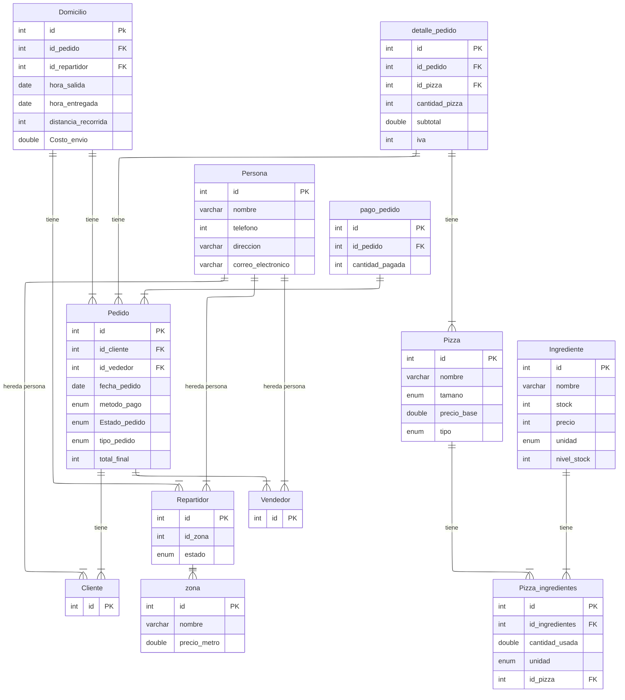

# README - Sistema de Gestión de Pizzería Don Piccolo

## Descripción del Proyecto
Este proyecto tiene como objetivo digitalizar la gestión de pedidos y domicilios de **Pizzería Don Piccolo**.  
Actualmente, la empresa lleva los pedidos de manera manual, lo que genera errores y retrasos. Con este sistema, se puede:  

- Registrar clientes, vendedores y repartidores.  
- Registrar pizzas y sus ingredientes, controlando el stock automáticamente.  
- Gestionar pedidos, domicilios y pagos.  
- Consultar información relevante para la toma de decisiones.  

Todo esto se implementa en **MySQL**, con tablas, relaciones, triggers, procedimientos y funciones que automatizan cálculos y registros.

---

## Modelo Lógico de la Base de Datos

**Explicación del Modelo Lógico:**  
El modelo lógico representa cómo se organizan los datos y las relaciones entre ellos en la base de datos:  

- Cada **Persona** puede ser un cliente, un vendedor o un repartidor.  
- Los **Clientes** hacen pedidos, y los **Vendedores** los registran.  
- Cada **Pedido** puede incluir varias **Pizzas** a través de **Detalle_Pedido**, donde se calcula el subtotal e IVA.  
- Las **Pizzas** están compuestas por **Ingredientes**, controlando automáticamente el stock.  
- Los **Domicilios** registran la entrega de pedidos por repartidor, calculando distancia y costo de envío.  
- Los **Pagos** se registran en relación a los pedidos, permitiendo seguimiento de montos pagados.  
- Se mantiene un **Historial de Precios** para auditar cambios de precio de las pizzas.  

El modelo lógico garantiza integridad de datos, consistencia de relaciones y facilita consultas y reportes.

---

## Tablas y Relaciones

1. **Persona**: almacena información básica de cualquier persona en el sistema.  
2. **Cliente y Vendedor**: heredan de Persona.  
3. **Zona**: almacena zonas geográficas y el precio por metro.  
4. **Repartidor**: hereda de Persona, con zona y estado.  
5. **Pizza**: nombre, tamaño, tipo y precio base.  
6. **Ingrediente**: nombre, stock, precio, unidad de medida y nivel mínimo.  
7. **Pizza_Ingredientes**: relación entre pizzas y sus ingredientes.  
8. **Pedido**: registro completo de pedidos.  
9. **Detalle_Pedido**: qué pizzas y cuántas se pidieron por pedido.  
10. **Domicilio**: hora de salida, entrega, distancia y costo de envío.  
11. **Pago_Pedido**: pagos realizados.  
12. **Historial_Precios**: registra cambios en los precios de pizzas.

---

## Funciones y Procedimientos

- **Funciones**:  
  - Calcular total de un pedido.  
  - Calcular ganancia neta diaria.  

- **Procedimientos**:  
  - Consultar pedidos entre fechas.  
  - Listar pizzas más vendidas.  
  - Consultar pedidos por repartidor.  
  - Calcular promedio de entrega por zona.  
  - Buscar clientes que gastaron más de cierto monto.  
  - Buscar pizzas por coincidencia parcial de nombre.  
  - Identificar clientes frecuentes (más de 5 pedidos en el mes).

---

## Triggers Automáticos

- Actualización de stock al registrar un pedido.  
- Auditoría de cambios de precios en pizzas.  
- Actualización de estado de repartidor.  
- Cálculo automático de subtotal, total e IVA.  
- Cálculo y suma de costo de envío al total del pedido.

---

## Consultas Útiles

- Pedidos entre fechas.  
- Pizzas más vendidas.  
- Pedidos por repartidor.  
- Promedio de entrega por zona.  
- Clientes que gastaron más de cierta cantidad.  
- Buscar pizzas por nombre.  
- Identificar clientes frecuentes.

---

## Cómo Usar el Sistema

1. Crear la base de datos y tablas.  
2. Insertar los datos iniciales (clientes, repartidores, pizzas, ingredientes, pedidos).  
3. Los triggers automatizan cálculos y control de stock.  
4. Ejecutar consultas o procedimientos para reportes.  
5. Actualizar precios de pizzas; el historial se registra automáticamente.

---

## Requerimientos Funcionales Cubiertos

- Gestión de Clientes, Pizzas, Pedidos, Repartidores y Domicilios.  
- Funciones y procedimientos automatizados.  
- Triggers que aseguran consistencia de datos.  
- Consultas y reportes para análisis de ventas y desempeño.  